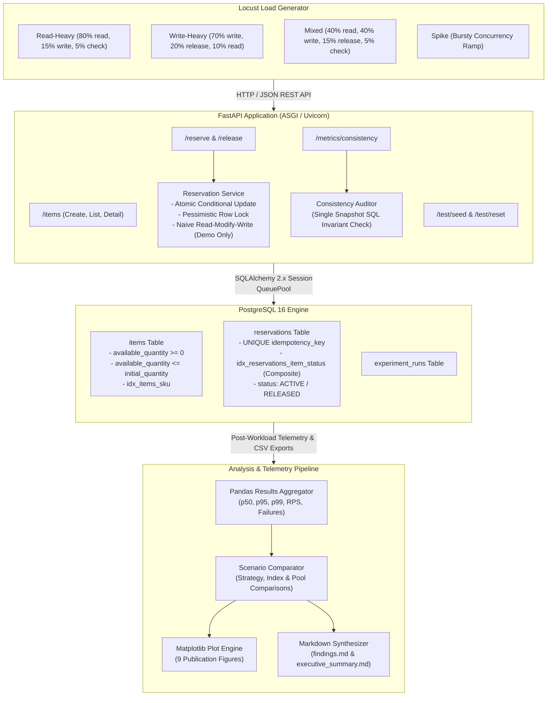

# API Load & Consistency Analyzer

> **Educational Engineering Experiment Notice**  
> This repository contains a controlled backend engineering and database consistency experiment simulating an inventory-reservation workflow. It is designed for educational performance analysis and concurrency research. It is **not** a financial exchange, trading engine, production banking platform, or live payment processor.

---

## Table of Contents
1. [Project Overview & Problem Statement](#project-overview--problem-statement)
2. [Why Load Testing Alone is Insufficient](#why-load-testing-alone-is-insufficient)
3. [Why Database Consistency Matters](#why-database-consistency-matters)
4. [System Architecture](#system-architecture)
5. [Domain Data Model](#domain-data-model)
6. [API Endpoints & Schema Specifications](#api-endpoints--schema-specifications)
7. [Concurrency-Control Strategies](#concurrency-control-strategies)
8. [Idempotency Design & Implementation](#idempotency-design--implementation)
9. [Database & Transaction Engineering](#database--transaction-engineering)
10. [Workload Profiles](#workload-profiles)
11. [Experimental Methodology & Metric Definitions](#experimental-methodology--metric-definitions)
12. [Post-Workload Consistency Invariants & Reconciliation](#post-workload-consistency-invariants--reconciliation)
13. [Local & Docker Setup Instructions](#local--docker-setup-instructions)
14. [Command Reference](#command-reference)
15. [Analysis Pipeline & Generated Deliverables](#analysis-pipeline--generated-deliverables)
16. [Measured Experimental Findings](#measured-experimental-findings)
17. [Limitations](#limitations)
18. [Troubleshooting Guide](#troubleshooting-guide)
19. [Comprehensive Interview Discussion Guide](#comprehensive-interview-discussion-guide)

---

## Project Overview & Problem Statement

Modern high-concurrency web services frequently face two competing pressures:
1. **Throughput and Latency Performance**: Maximizing requests served per second while maintaining strict percentile response bounds (p50, p95, p99).
2. **Logical State Correctness (Consistency)**: Preventing race conditions, double-allocations, negative balances, lost updates, and phantom reads under intense concurrent traffic.

Standard benchmarking frameworks (such as Apache Bench or k6) report HTTP status codes and response times, but treat the database as a black box. An API returning `200 OK` or `201 Created` under load can silently violate business invariants—such as overselling constrained inventory or creating duplicate reservations due to non-atomic check-then-act sequences.

**API Load & Consistency Analyzer** answers two core engineering questions:
1. *How does API latency, throughput, and error categorization behave as concurrent traffic increases across diverse workload profiles?*
2. *Does the underlying PostgreSQL database remain strictly correct and logically reconciled after concurrent write operations across different concurrency-control strategies?*

---

## Why Load Testing Alone is Insufficient

Traditional load testing measures the *client's external perception* of the system:
- Did the request succeed with HTTP 2xx?
- How long did the round-trip take?

However, load testing tools cannot verify internal database state:
- **Silent Lost Updates**: Two concurrent threads read available quantity `10`, both reserve `5`, and both write back `5` (instead of `0`). Both clients receive `201 Created`, but the business lost inventory.
- **Overselling**: Ten concurrent requests for the last available item all evaluate `available >= 1` before any single transaction commits, creating 10 reservations for 1 unit.
- **Orphaned State**: A partial transaction failure creates an audit row but fails to decrement inventory, or vice-versa.

Without an automated **post-workload consistency audit**, a benchmark that reports "100% 2xx responses" may in reality be executing a broken, corrupt system.

---

## Why Database Consistency Matters

In multi-user reservation, booking, or financial systems, database consistency is not a passive property of ACID isolation levels—it requires explicit application and database level synchronization:
- **Business Trust**: Overselling inventory creates unfulfillable orders, customer churn, and manual remediation costs.
- **Financial Reconciliation**: System assets must satisfy exact conservation laws:  
  $$\text{Initial Inventory} - \sum(\text{Active Reservations}) = \text{Currently Available Inventory}$$
- **Data Durability**: Consistency must hold across process crashes, connection pool exhaustion, lock contention, and client retries.

---

## System Architecture

The architecture consists of an asynchronous Python application layer backed by a relational PostgreSQL database with connection pooling and automated telemetry:



---

## Domain Data Model

The schema is defined in SQLAlchemy 2.0 and managed via Alembic migrations.

### `items` Table
| Column | Type | Constraints | Description |
|---|---|---|---|
| `id` | INTEGER | PRIMARY KEY, AUTOINCREMENT | Item surrogate ID |
| `sku` | VARCHAR(64) | UNIQUE, NOT NULL, INDEXED | Stock Keeping Unit |
| `name` | VARCHAR(255) | NOT NULL | Item descriptive name |
| `available_quantity`| INTEGER | NOT NULL, CHECK (>= 0) | Currently available stock |
| `initial_quantity` | INTEGER | NOT NULL, CHECK (>= 0) | Starting baseline stock |
| `version` | INTEGER | NOT NULL, DEFAULT 1 | Optimistic version counter |
| `created_at` | TIMESTAMPTZ | NOT NULL, DEFAULT now() | Creation timestamp |
| `updated_at` | TIMESTAMPTZ | NOT NULL, DEFAULT now() | Last update timestamp |

**Table Invariants**:
- `chk_item_available_qty_non_negative`: `available_quantity >= 0`
- `chk_item_initial_qty_non_negative`: `initial_quantity >= 0`
- `chk_item_available_lte_initial`: `available_quantity <= initial_quantity`
- `idx_items_sku`: B-tree index on `sku`

### `reservations` Table
| Column | Type | Constraints | Description |
|---|---|---|---|
| `id` | INTEGER | PRIMARY KEY, AUTOINCREMENT | Reservation ID |
| `item_id` | INTEGER | FK -> items(id) RESTRICT | Referenced Item |
| `quantity` | INTEGER | NOT NULL, CHECK (> 0) | Reserved item count |
| `idempotency_key` | VARCHAR(128)| UNIQUE, NOT NULL, INDEXED | Client deduplication key |
| `status` | VARCHAR(20) | NOT NULL, DEFAULT 'ACTIVE'| 'ACTIVE' or 'RELEASED' |
| `created_at` | TIMESTAMPTZ | NOT NULL, DEFAULT now() | Reservation timestamp |
| `released_at` | TIMESTAMPTZ | NULLABLE | Release timestamp |

**Table Invariants**:
- `chk_reservation_qty_positive`: `quantity > 0`
- `chk_reservation_status_valid`: `status IN ('ACTIVE', 'RELEASED')`
- `idx_reservations_idempotency_key`: Unique B-tree index on `idempotency_key`
- `idx_reservations_item_status`: Composite B-tree index on `(item_id, status)`

---

## API Endpoints & Schema Specifications

| Method | Path | Description | Expected Status Codes |
|---|---|---|---|
| `GET` | `/health` | Application & DB health, pool statistics | `200 OK`, `503 Service Unavailable` |
| `POST`| `/items` | Create a new item | `201 Created`, `409 Conflict`, `422 Unprocessable` |
| `GET` | `/items` | List paginated items | `200 OK` |
| `GET` | `/items/{item_id}` | Retrieve item by ID | `200 OK`, `404 Not Found` |
| `POST`| `/items/{item_id}/reserve` | Reserve item inventory | `201 Created`, `404 Not Found`, `409 Conflict`, `422 Unprocessable` |
| `POST`| `/reservations/{id}/release` | Release an active reservation | `200 OK`, `404 Not Found`, `409 Conflict` |
| `GET` | `/reservations/{id}` | Get reservation details | `200 OK`, `404 Not Found` |
| `GET` | `/metrics/consistency` | Run full database invariant audit | `200 OK` |
| `POST`| `/test/seed` | Seed test items (test mode only) | `200 OK`, `403 Forbidden` |
| `POST`| `/test/reset` | Truncate database (test mode only) | `200 OK`, `403 Forbidden` |

### Error Response Schema
All client rejections and system errors return structured JSON:
```json
{
  "error_code": "INSUFFICIENT_INVENTORY",
  "message": "Insufficient inventory for item 42: requested 5, available 2.",
  "details": null
}
```

---

## Concurrency-Control Strategies

The system implements and benchmarks multiple concurrency strategies:

### 1. Atomic Conditional Update (`atomic_update`)
Executes an atomic SQL statement with a conditional check:
```sql
UPDATE items
SET available_quantity = available_quantity - :qty,
    version = version + 1,
    updated_at = NOW()
WHERE id = :item_id AND available_quantity >= :qty
RETURNING available_quantity;
```
- **Mechanism**: Relies on PostgreSQL's row-level lock during the UPDATE phase. If the condition `available_quantity >= :qty` fails, zero rows are updated.
- **Advantage**: High throughput, no long-held transaction locks, minimal lock contention.
- **Correctness**: Zero overselling guaranteed by the database engine.

### 2. Pessimistic Row Locking (`pessimistic_lock`)
Acquires an exclusive row-level lock before reading or updating:
```sql
SELECT * FROM items WHERE id = :item_id FOR UPDATE;
-- Application checks inventory >= qty
UPDATE items SET available_quantity = available_quantity - :qty WHERE id = :item_id;
```
- **Mechanism**: Blocks concurrent transactions attempting to read or lock the same row until the active transaction commits.
- **Advantage**: Full transactional isolation; suitable for complex multi-table checks.
- **Trade-off**: Higher lock queueing latency under intense contention on a single item.

### 3. Naive Read-Modify-Write (`naive` - Unsafe / Isolated Experiment Only)
- Performs a simple `SELECT`, checks available quantity in Python memory, and issues an unconstrained `UPDATE`.
- **Purpose**: Demonstrates lost-update phenomena and overselling under load when concurrency control is absent. Never used in production or safe modes.

---

## Idempotency Design & Implementation

To prevent network retries or duplicate user clicks from creating duplicate reservations:
1. Every reservation request requires an `idempotency_key` string.
2. The database enforces a `UNIQUE` index on `reservations.idempotency_key`.
3. When a request arrives:
   - If the key exists with identical parameters (`item_id`, `quantity`), the API returns the original reservation record with HTTP `201` (`idempotent replay`).
   - If the key exists with mismatched parameters, the API returns HTTP `409 IDEMPOTENCY_CONFLICT`.
   - Concurrent simultaneous submissions with identical keys are serialized by the database index; exactly one transaction succeeds, and the other safely retrieves the committed record.

---

## Workload Profiles

Locust generates distinct traffic mixes across virtual users:

| Profile | Read Share | Write Share | Release Share | Consistency Checks | Primary Objective |
|---|---|---|---|---|---|
| **Read-Heavy** | 80% | 15% | 0% | 5% | Measure cache and read throughput under low contention |
| **Write-Heavy**| 10% | 70% | 20% | 0% | Maximize write contention and lock competition |
| **Mixed** | 40% | 40% | 15% | 5% | Realistic e-commerce browsing, booking, and cancellation |
| **Spike** | 30% | 55% | 10% | 5% | Sudden burst concurrency testing tail latency degradation |

---

## Experimental Methodology & Metric Definitions

### Metrics Captured
- **Total Requests & RPS**: Total requests executed and sustained requests/sec.
- **Percentile Latencies**:
  - **p50 (Median)**: Standard user experience.
  - **p95**: 95th percentile response time.
  - **p99**: Tail latency representing worst 1% of transactions under lock queueing.
- **Failure Classification**:
  - *Expected Business Rejections*: HTTP 409 `INSUFFICIENT_INVENTORY` (not server failures).
  - *Client Errors*: HTTP 422 `VALIDATION_ERROR`.
  - *Server / DB Failures*: HTTP 500 or connection pool timeouts.
- **Database Consistency Violations**: Count of invariant failures discovered during post-workload audit.

---

## Post-Workload Consistency Invariants & Reconciliation

After every load test run, the system executes an automated audit verifying:
1. $\text{available\_quantity} \ge 0$ (No negative inventory).
2. $\text{available\_quantity} \le \text{initial\_quantity}$ (No over-credited stock).
3. $\text{Initial Quantity} - \sum(\text{Active Reservations}) = \text{Available Quantity}$ (Exact reconciliation balance).
4. No duplicate idempotency keys in `reservations`.
5. No orphaned reservations referencing deleted items.
6. Releasing a reservation twice returns 409 and never increases inventory twice.

---

## Local & Docker Setup Instructions

### Prerequisites
- Python 3.11+
- Docker & Docker Compose
- PostgreSQL 16+ (or via Docker)

### Option A: Running with Docker Compose
```bash
# 1. Start PostgreSQL and FastAPI service
docker compose up -d --build

# 2. Verify health
curl http://localhost:8000/health
```

### Option B: Running Locally with Virtual Environment
```bash
# 1. Create and activate virtual environment
python -m venv .venv
# On Windows:
.venv\Scripts\activate
# On Linux/macOS:
source .venv/bin/activate

# 2. Install dependencies
pip install -r requirements.txt

# 3. Start PostgreSQL container
docker compose up -d db

# 4. Run migrations
alembic upgrade head

# 5. Start API server
uvicorn app.main:app --host 127.0.0.1 --port 8000 --reload
```

---

## Command Reference

### Master Pipeline
Execute migrations, tests, experiment matrix, aggregations, figures, and reports in a single command:
```bash
# Full benchmark run:
python scripts/run_all.py

# Short smoke test suite:
python scripts/run_all.py --smoke
```

### Running Automated Tests
```bash
python scripts/run_tests.py
# or
pytest -v
```

### Running Individual Experiments & Analysis
```bash
# 1. Seed database
python -m experiments.seed_database --items 20 --inventory 200

# 2. Run Locust load test (Headless)
locust -f load_tests/locustfile.py --headless -u 50 -r 10 -t 15s --host http://127.0.0.1:8000 --csv results/manual_run

# 3. Audit consistency
python -m experiments.consistency_checks --output-dir results --tag manual_run

# 4. Run query plan analysis (EXPLAIN ANALYZE)
python -m experiments.query_plan_analysis

# 5. Run analysis pipeline and generate reports
python -m analysis.aggregate_results
python -m analysis.compare_scenarios
python -m analysis.plot_results
python -m analysis.generate_report
```

---

## Analysis Pipeline & Generated Deliverables

The analysis pipeline generates all required artifacts in `reports/`:

```
reports/
|-- figures/
|   |-- p95_latency_vs_concurrency.png
|   |-- p99_latency_vs_concurrency.png
|   |-- throughput_vs_concurrency.png
|   |-- failure_rate_vs_concurrency.png
|   |-- consistency_violations_by_scenario.png
|   |-- strategy_comparison.png
|   |-- index_comparison.png
|   |-- pool_configuration_comparison.png
|   |-- endpoint_latency_comparison.png
|
|-- tables/
|   |-- experiment_summary.csv
|   |-- endpoint_metrics.csv
|   |-- consistency_results.csv
|   |-- strategy_comparison.csv
|   |-- index_comparison.csv
|   |-- pool_comparison.csv
|   |-- error_breakdown.csv
|
|-- metrics.json
|-- findings.md
|-- executive_summary.md
```

---

## Measured Experimental Findings

Detailed findings dynamically synthesized from benchmark outputs are available in [`reports/findings.md`](reports/findings.md) and [`reports/executive_summary.md`](reports/executive_summary.md).

---

## Limitations

For the complete hardware and experimental constraints analysis, see [`LIMITATIONS.md`](LIMITATIONS.md).
Key limitations include:
- Benchmarking conducted on single local host (shared CPU/memory between client, API, and DB).
- Synthetic traffic distributions do not model complex multi-region WAN latency or network jitter.
- Lock contention dynamics reflect PostgreSQL row-level locking specifics.

---

## Troubleshooting Guide

1. **Port 5432 or 8000 Conflict**:
   - Check existing containers: `docker ps`. Stop conflicting services via `docker stop <container_id>`.
2. **Database Migration Errors**:
   - Reset tables: `python scripts/reset_environment.py`.
3. **Locust Subprocess Timeout**:
   - Ensure the API is responsive at `http://127.0.0.1:8000/health` prior to launching headless runs.

---

## Comprehensive Interview Discussion Guide

### 1. Why is average latency insufficient for evaluating API performance?
Average (mean) latency obscures tail latency behavior because a small percentage of extremely slow requests (e.g. lock contention or GC pauses) gets smoothed out by thousands of fast requests. Percentiles like p95 and p99 reveal the true experience of worst-case users and detect queueing bottlenecks.

### 2. What does p95 latency mean in practice?
p95 latency means that 95% of all requests were served in that amount of time or faster, while 5% took longer. In high-traffic services, 5% represents thousands of customer interactions per hour.

### 3. What is a lost update anomaly?
A lost update occurs when two concurrent transactions read the same initial state (e.g., `inventory = 10`), independently compute new values based on that read (e.g., `10 - 2 = 8` and `10 - 3 = 7`), and write back their results without synchronization. The second write overwrites the first, causing the first transaction's update to be lost.

### 4. How does the atomic conditional update prevent overselling?
The atomic conditional update (`UPDATE items SET available_quantity = available_quantity - qty WHERE id = :id AND available_quantity >= qty`) evaluates the constraint and modifies the row in a single atomic database operation. PostgreSQL applies a row lock during the statement evaluation; if available inventory is insufficient, the row count is 0, guaranteeing no overselling occurs without needing a multi-step transaction lock.

### 5. When is `SELECT FOR UPDATE` useful compared to atomic updates?
`SELECT FOR UPDATE` is necessary when business logic requires complex multi-table validation, reading related records, or performing calculations in application code before deciding whether to update.

### 6. What is the operational cost of pessimistic row locking?
Pessimistic row locking forces concurrent transactions targeting the same row into a serial queue. Under high concurrency on hot rows, this increases lock wait times, inflates p99 tail latency, and consumes connection pool slots while transactions wait.

### 7. What is idempotency and why is it necessary in reservation APIs?
Idempotency ensures that performing an operation multiple times produces the exact same result as performing it once. In network-distributed environments, client timeouts or retries can resubmit the same reservation request; idempotency prevents charging or allocating stock multiple times.

### 8. Why is a database uniqueness constraint necessary for true idempotency?
In-memory deduplication (like a Redis set or Python dict) is vulnerable to cache evictions, node crashes, and race conditions across distributed API replicas. A database uniqueness constraint enforces deduplication at the source of truth with ACID atomicity.

### 9. What problem does connection pooling solve?
Establishing a TCP handshake and PostgreSQL backend process for every HTTP request is computationally expensive (~20-50ms). Connection pooling maintains a pool of warm, reusable database connections, reducing query latency to sub-millisecond connection checkout.

### 10. How can an oversized connection pool hurt performance?
An oversized connection pool can overwhelm the PostgreSQL server with too many concurrent worker processes, causing excessive context switching, CPU cache invalidation, and disk I/O thrashing. Sizing the pool according to PostgreSQL core capacity optimizes throughput.

### 11. What makes an index useful?
An index provides an ordered B-tree data structure allowing the database engine to locate matching rows in $O(\log N)$ time rather than performing an $O(N)$ sequential table scan.

### 12. Why can adding indexes slow write operations?
Every `INSERT`, `UPDATE`, or `DELETE` on an indexed table requires updating both the primary table heap and all associated B-tree index structures, increasing write I/O and transaction commit time.

### 13. Why verify database state after a load test?
Load tests only measure client-side response codes. Automated invariant audits verify that data structures remained consistent, constraints were respected, and no silent corruptions occurred during high-concurrency contention.

### 14. How do you distinguish expected business rejections from system failures?
Expected business rejections (such as returning HTTP 409 when inventory is exhausted) represent correct application logic and should not be counted as system faults. System failures (HTTP 500, unhandled exceptions, database timeouts) represent operational issues and must be tracked separately.

### 15. Why are local benchmark results hardware-dependent?
Single-machine benchmarks share CPU, memory, and disk I/O between the load generator (Locust), API runtime (Uvicorn), and database engine (PostgreSQL). Core contention and OS scheduling directly impact measured throughput and latency.
