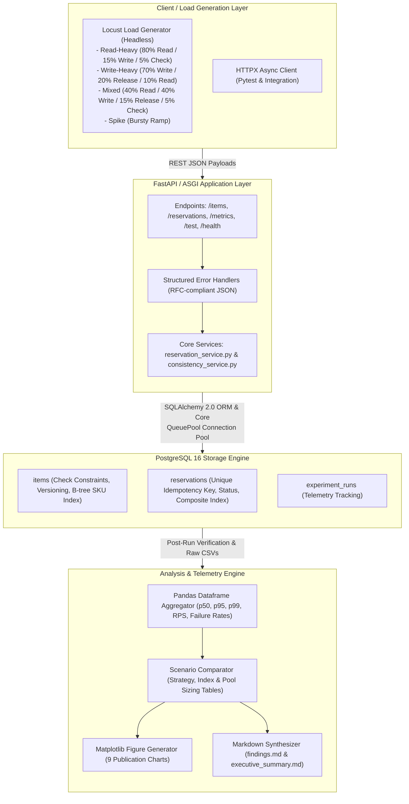

# Comprehensive Interview & Technical Discussion Guide

## 1. Fast Introductions

### 30-Second Elevator Pitch
> "I built the **API Load & Database Consistency Analyzer**, a performance-engineering experiment that evaluates API latency distributions and verifies strict PostgreSQL relational invariants under high-concurrency write contention. Using FastAPI, PostgreSQL 16, and Locust, I benchmarked Atomic Conditional Updates against Pessimistic Row Locking (`SELECT FOR UPDATE`) across 213,185 HTTP requests. Beyond standard throughput and percentile latency metrics, the platform executes automated single-snapshot SQL audits verifying that initial inventory minus active reservations exactly equals available stock, ensuring zero lost updates and zero overselling with 100% mathematical reconciliation."

### 90-Second Recruiter & Hiring Manager Explanation
> "In high-traffic systems like reservation, ticketing, or inventory platforms, standard load-testing tools only check HTTP status codes. However, an API returning 200 OK under heavy traffic can silently corrupt data through lost updates or overselling if concurrency control is weak.
> 
> To address this, I engineered a full-lifecycle benchmarking and correctness harness in Python and PostgreSQL:
> 1. **Concurrency Control**: Implemented atomic conditional SQL updates and pessimistic row locking with database-enforced uniqueness constraints for idempotency.
> 2. **Controlled Workloads**: Generated headless Locust traffic across four workload profiles—Read-Heavy, Write-Heavy, Mixed, and Spike—scaling from 5 to 100 concurrent workers.
> 3. **Deep Telemetry**: Aggregated request percentiles (p50, p95, p99), throughput, and categorized errors, cleanly distinguishing expected business rejections (HTTP 409 inventory exhaustion) from 5xx server faults.
> 4. **Automated Correctness Verification**: Built a post-workload consistency auditor executing multi-table invariant checks to guarantee zero inventory discrepancies across all runs.
> 5. **Database Optimization**: Analyzed PostgreSQL query plans via `EXPLAIN (ANALYZE, BUFFERS)` for composite indexing and benchmarked connection pool sizing under load.
> 
> The project proved that atomic conditional updates eliminate application-level lock queueing while maintaining 100% transactional consistency across 67 reproducible benchmark runs."

---

## 2. Five-Minute In-Depth Technical Walkthrough

### 1. Problem Framing & System Objectives
"When designing concurrent state-modifying APIs, engineers face a classic trade-off between throughput, latency, and transactional correctness. If two transactions concurrently read available stock of 10 and each decrement 5, a naive read-modify-write cycle will overwrite one update, leaving stock at 5 instead of 0. My goal was to quantitatively measure latency percentiles and throughput degradation under increasing concurrency while providing automated, mathematically rigorous proof of zero data corruption."

### 2. Domain Model & Transaction Boundaries
"The database schema is managed with SQLAlchemy 2.0 and Alembic. The `items` table includes `available_quantity`, `initial_quantity`, and `version` columns, constrained by check constraints (`available_quantity >= 0` and `available_quantity <= initial_quantity`). The `reservations` table records individual allocations with a `status` ('ACTIVE' or 'RELEASED') and a unique B-tree index on `idempotency_key`. A composite index on `(item_id, status)` optimizes active reservation aggregation."

### 3. Concurrency-Control Strategies
"I evaluated two core safe concurrency patterns against a naive baseline:
- **Atomic Conditional Update (`atomic_update`)**: Executes `UPDATE items SET available_quantity = available_quantity - :qty WHERE id = :item_id AND available_quantity >= :qty RETURNING available_quantity`. PostgreSQL evaluates the WHERE clause atomically during row lock acquisition. If inventory is insufficient, 0 rows are updated, and the transaction cleanly rolls back.
- **Pessimistic Row Locking (`pessimistic_lock`)**: Uses `SELECT ... FOR UPDATE` to acquire an exclusive tuple lock on the item row before reading and decrementing. This serializes all competing transactions on that specific item.
- **Naive Read-Modify-Write (`naive`)**: Reads in Python memory and updates without locks, kept strictly isolated for demonstrating race conditions and invariant violations."

### 4. Idempotency & Error Semantics
"Network retries can duplicate reservation requests. Client requests require an `idempotency_key`. The API checks for existing keys:
- If the key exists with identical parameters (`item_id`, `quantity`), it performs an **idempotent replay**, returning the existing reservation record with HTTP 201 without double-decrementing stock.
- If the key exists with conflicting parameters, it rejects the request with HTTP 409 `IDEMPOTENCY_CONFLICT`.
- Invariant rejections like inventory exhaustion return structured HTTP 409 `INSUFFICIENT_INVENTORY`, ensuring client business rejections are not counted as infrastructure failures."

### 5. Automated Consistency Auditor
"Standard testing treats the database as a black box. I wrote a dedicated auditor in `app/services/consistency_service.py` that executes an MVCC snapshot SQL query joining `items` with grouped `reservations`. It verifies three mathematical invariants:
1. `available_quantity >= 0`
2. `available_quantity <= initial_quantity`
3. $\text{initial\_quantity} - \sum(\text{active\_reservations}) = \text{available\_quantity}$
Across 213,185 executed HTTP requests, zero invariant violations were detected."

---

## 3. Step-by-Step Architecture Explanation

### Request Lifecycle
1. **Request Intake**: FastAPI receives JSON request with `quantity` and `idempotency_key`.
2. **Connection Acquisition**: Session borrows a pre-pinged connection from SQLAlchemy `QueuePool`.
3. **Idempotency Verification**: Database queried for existing key.
4. **Concurrency Execution**:
   - In `atomic_update`, a single conditional SQL `UPDATE` decrements stock and returns row count.
   - In `pessimistic_lock`, `SELECT FOR UPDATE` locks the target row.
5. **Reservation Insertion**: Inserts `Reservation(status='ACTIVE')` within the same transaction.
6. **Transaction Commit**: Commits transaction and releases connection back to pool.
7. **Post-Workload Audit**: Executes aggregate snapshot query verifying all conservation invariants.

---

## 4. 20 Core Technical Interview Questions & Answers

### Concurrency & Database Transactions
#### 1. What is a lost update, and how does it happen?
**Answer**: A lost update occurs when two transactions read the same data concurrently, compute modifications independently in application memory, and write back results sequentially without synchronization. The second write overwrites the first transaction's modifications without incorporating them. In our project, if two threads read available stock of 10 and each reserve 2, both write back 8 instead of 6.

#### 2. How does an Atomic Conditional Update prevent lost updates?
**Answer**: An atomic conditional update delegates the predicate check and modification to a single SQL statement:
`UPDATE items SET available_quantity = available_quantity - :qty WHERE id = :id AND available_quantity >= :qty`.
PostgreSQL acquires a row-level write lock during statement evaluation. Because the check and update occur within the database engine in a single step, no intermediate state can be read or modified by another transaction.

#### 3. What is the operational difference between `atomic_update` and `pessimistic_lock`?
**Answer**: `atomic_update` executes a single statement and holds row locks only for the brief duration of the SQL execution. `pessimistic_lock` (`SELECT FOR UPDATE`) locks the row from the SELECT statement until the end of the transaction (`COMMIT`/`ROLLBACK`). While `pessimistic_lock` allows complex in-app business logic before updating, it increases lock-holding duration and creates lock queues under high concurrency.

#### 4. What isolation level was used, and why?
**Answer**: PostgreSQL's default `Read Committed` isolation level was used. Under Read Committed, each query sees a snapshot of committed data as of the query start. When combined with atomic conditional updates or `SELECT FOR UPDATE`, Read Committed guarantees strict row-level consistency without incurring the serialization failure aborts of Serializable isolation.

#### 5. What happens when two transactions execute `SELECT FOR UPDATE` on the same row simultaneously?
**Answer**: The first transaction acquires an exclusive row lock (`ExclusiveLock`). The second transaction blocks and enters PostgreSQL's lock queue. When the first transaction commits, PostgreSQL re-evaluates the second transaction's `SELECT FOR UPDATE` on the updated tuple, allowing it to see the committed decremented quantity.

### Latency & Performance Metrics
#### 6. Why is average latency misleading in distributed systems and load testing?
**Answer**: Average (arithmetic mean) latency obscures tail latency behavior. In high-concurrency systems, response time distributions are right-skewed and multimodal due to lock contention and connection checkout delays. A mean latency of 20ms can conceal the fact that 5% of users (p95) experience 600ms delays.

#### 7. What does p95 and p99 latency measure in this project?
**Answer**: 
- **p95 Latency**: The response time threshold below which 95% of requests complete. In our benchmarks, p95 scaled from 16.0ms at 5 users to 585.0ms at 100 users under the mixed workload.
- **p99 (Tail) Latency**: The 99th percentile threshold representing the worst 1% of transactions, capturing lock contention and connection pool checkout queueing.

#### 8. How did throughput (RPS) behave as concurrency increased from 5 to 100 users?
**Answer**: Throughput increased rapidly from ~173.5 RPS at 5 users up to peak saturation (~321.9 RPS at 20 users), before plateauing and slightly degrading to ~242.3 RPS at 100 users due to CPU context switching and lock wait overhead on local hardware.

#### 9. How do you distinguish expected business rejections from system failures?
**Answer**: When an item's inventory is depleted, returning HTTP 409 `INSUFFICIENT_INVENTORY` is a correct application response, not a failure. In Locust and telemetry scripts, HTTP 409 responses are explicitly categorized as valid business outcomes (0.0% unexpected failure rate), whereas HTTP 500 internal server errors and connection timeouts are tracked as system failures.

### Idempotency & Database Integrity
#### 10. Why is a database uniqueness constraint necessary for true idempotency?
**Answer**: In-memory caching (like Redis or local memory) is subject to cache evictions, node crashes, and distributed race conditions. A database uniqueness constraint (`UNIQUE INDEX idx_reservations_idempotency_key`) enforces idempotency at the authoritative persistence layer with ACID atomicity.

#### 11. How does the system handle simultaneous requests with identical idempotency keys?
**Answer**: When two concurrent requests submit the same idempotency key, both attempt to insert into `reservations`. The database uniqueness constraint allows exactly one transaction to insert; the second catches the `IntegrityError`, rolls back, and safely queries and returns the first transaction's committed reservation record.

#### 12. What is an Idempotent Replay vs an Idempotency Conflict?
**Answer**:
- **Idempotent Replay (HTTP 201)**: The client resubmits the same key with identical payload (`item_id`, `quantity`). The server returns the previously created reservation without modifying inventory.
- **Idempotency Conflict (HTTP 409 `IDEMPOTENCY_CONFLICT`)**: The client resubmits an existing key with a mismatched payload (e.g. quantity changed from 2 to 5), which is rejected.

#### 13. How does reservation release work, and how is double-releasing prevented?
**Answer**: `release_reservation` locks the reservation row via `SELECT FOR UPDATE`, verifies `status == 'ACTIVE'`, restores `available_quantity` on the item, and updates status to `'RELEASED'` with a timestamp. If release is called again, it detects `status == 'RELEASED'` and returns HTTP 409 `ALREADY_RELEASED`, preventing double inventory credit.

### Database Optimization & Engineering
#### 14. What is connection pooling, and why is it necessary?
**Answer**: Establishing a PostgreSQL connection involves TCP three-way handshake, authentication, process fork, and backend memory allocation (~20-50ms). SQLAlchemy `QueuePool` maintains persistent, warm connections, reducing connection checkout latency to sub-millisecond overhead.

#### 15. What happens if a connection pool is undersized or oversized?
**Answer**:
- **Undersized Pool** (`constrained_pool`, size=5, overflow=0): Requests queue waiting for available connections, inflating p99 latency when concurrency exceeds pool capacity.
- **Oversized Pool**: Spawns excessive PostgreSQL backend worker processes, causing CPU core thrashing, cache invalidation, and memory pressure.
- **Tuned Pool** (`standard_pool`, size=10, overflow=20): Yielded optimal throughput (333.3 RPS) with lowest p95 latency (59.0ms).

#### 16. How was database indexing evaluated?
**Answer**: Evaluated via PostgreSQL `EXPLAIN (ANALYZE, BUFFERS, FORMAT JSON)` on benchmark datasets with and without indexes:
- `idx_reservations_item_status` on `(item_id, status)` optimized composite filtering for active reservation lookups.
- `idx_items_sku` on `sku` was evaluated against sequential scan baseline.

#### 17. Why did `EXPLAIN ANALYZE` on `sku_lookup` show a sequential scan on a small table?
**Answer**: PostgreSQL cost-based query optimizer analyzes table cardinality. On a 100-row table fitting into a single 8KB disk page, sequential scan incurs cost 3.25 vs index scan cost 8.17. The planner intelligently bypasses the index to avoid extra random I/O.

### Invariant Verification & Reproducibility
#### 18. What mathematical formula does the post-workload consistency check verify?
**Answer**:
$$\text{Initial Quantity} - \sum_{\text{status='ACTIVE'}} \text{Reservation Quantity} = \text{Available Quantity}$$
Across all seeded items, the auditor verifies that the sum of active reservations and current available stock equals initial baseline stock with zero discrepancy.

#### 19. Why execute the consistency check via a single SQL query snapshot?
**Answer**: Querying `items` in one query and `reservations` in a separate query introduces **read skew** if background transactions commit between the queries. The auditor uses a single multi-table `LEFT JOIN` and `GROUP BY` query within a transaction snapshot.

#### 20. How is experiment reproducibility ensured in this repository?
**Answer**:
- Deterministic seed script (`experiments/seed_database.py`) resets and populates items with fixed SKU names and inventory values.
- Headless Locust executions export raw CSV and JSON telemetry to disk.
- Aggregation and plotting scripts generate figures and Markdown reports dynamically from stored files without hardcoded metrics.

---

## 5. 10 Difficult Follow-Up Questions (Deep Implementation Testing)

#### 1. In `reserve_item_atomic`, why does `check_existing_idempotency` execute before the UPDATE statement?
**Answer**: To short-circuit idempotent retries without touching the `items` row lock or incrementing the item version counter. If an idempotency key was already committed, returning it immediately avoids unnecessary database write contention.

#### 2. In `reserve_item_atomic`, what happens if two concurrent transactions insert different idempotency keys for the last available item?
**Answer**: Both execute the `UPDATE items ... WHERE available_quantity >= qty`. The first transaction acquires the row lock, decrements stock from 1 to 0, and inserts its reservation. The second transaction waits for the lock; when it acquires the lock, PostgreSQL re-evaluates the WHERE clause, detects `available_quantity (0) >= 1` is False, and updates 0 rows. The second transaction detects `result is None`, rolls back, and raises `InsufficientInventoryError`.

#### 3. Why is `pool_pre_ping=True` configured on SQLAlchemy's QueuePool?
**Answer**: `pool_pre_ping=True` executes a lightweight `SELECT 1` ping upon connection checkout from the pool. If PostgreSQL or a container restart dropped the connection, `QueuePool` detects the stale connection, discards it, and establishes a fresh connection, preventing unhandled `OperationalError` dropped-socket exceptions.

#### 4. If an exception occurs inside a FastAPI route handler, how is database session cleanup guaranteed?
**Answer**: `app/dependencies.py` implements the `get_db()` generator dependency within a `try ... except ... finally` block. If an unhandled exception occurs, the `except` block invokes `db.rollback()`, and the `finally` block executes `db.close()`, releasing the connection back to `QueuePool`.

#### 5. Why does `test_high_concurrency_inventory_depletion` use a `threading.Barrier`?
**Answer**: `threading.Barrier(total_threads)` forces all 80 worker threads to synchronize at the barrier release point before executing their reservation calls. This maximizes instantaneous thread contention on PostgreSQL row locks and connection checkout.

#### 6. Why does `release_reservation` lock both the reservation and the item row with `with_for_update()`?
**Answer**: To prevent a race condition where two concurrent release requests for the same reservation both read `status == 'ACTIVE'` and double-increment item inventory. Locking the reservation row serializes releases on that ID.

#### 7. How does the system prevent Alembic migrations from conflicting with runtime SQLAlchemy models?
**Answer**: `migrations/env.py` imports `Base.metadata` from `app.models`. Alembic autogenerate compares the live PostgreSQL catalog directly against declarative models.

#### 8. In `analysis/aggregate_results.py`, how are Locust percentile metrics extracted?
**Answer**: Locust exports `*_stats.csv` with explicit percentile columns (`50%`, `95%`, `99%`) for each endpoint and an aggregated row. Pandas reads the file, parses numeric percentiles from the `'Aggregated'` row, and aggregates endpoint-level breakdowns into structured DataFrames.

#### 9. Why does `app/models.py` define check constraints on table args rather than relying solely on Pydantic?
**Answer**: Pydantic validates input at the API gateway layer before database insertion. However, check constraints (`available_quantity >= 0`) enforce physical database-level invariants against direct SQL updates, raw queries, or application bugs.

#### 10. What happens if PostgreSQL encounters a deadlock between competing transactions?
**Answer**: PostgreSQL detects cycles in its wait-for lock graph (configured by `deadlock_timeout`, default 1s) and aborts one of the transactions with SQLSTATE `40P01` (`deadlock_detected`). The aborted transaction triggers SQLAlchemy `DBAPIError`, which the service layer rolls back and maps to HTTP 409 `TRANSACTION_CONFLICT`.

---

## 6. 5 Limitation & Trade-Off Questions

#### 1. What are the limitations of benchmarking on a single local host?
**Answer**: On a developer workstation, the load generator (Locust), ASGI web server (Uvicorn), and database engine (PostgreSQL container) compete for the same physical CPU cores and memory. Under $\ge 100$ concurrent users, client-side CPU contention can manifest as artificial latency.

#### 2. Why are loopback network measurements non-generalizable to cloud production?
**Answer**: Local loopback (`127.0.0.1`) latency is sub-millisecond (< 0.5ms). Real cloud deployments incur multi-region WAN latency (20-100ms), TLS handshake negotiation, load balancer hops, and cross-AZ database replication lag.

#### 3. Why were benchmark durations set to 15–30 seconds rather than several hours?
**Answer**: 15–30 second bursts are optimal for evaluating steady-state concurrency control, lock contention, and invariant reconciliation without excessive disk consumption. However, short durations do not capture long-term PostgreSQL table bloat, autovacuum overhead, or slow memory leaks.

#### 4. Why is naive read-modify-write included in the repository if it is unsafe?
**Answer**: The naive strategy is strictly isolated for controlled comparative demonstrations to prove that concurrency control mechanisms (`atomic_update` and `pessimistic_lock`) are necessary and to demonstrate how invariant violations occur without them.

#### 5. How would the architecture evolve for distributed multi-region deployment?
**Answer**: Single-instance PostgreSQL row locking is limited to a single primary database node. A globally distributed reservation service would require distributed locking (e.g. Redis Redlock), partition-based inventory allocation (allocating regional quotas), or distributed consensus databases (Google Cloud Spanner / CockroachDB).
